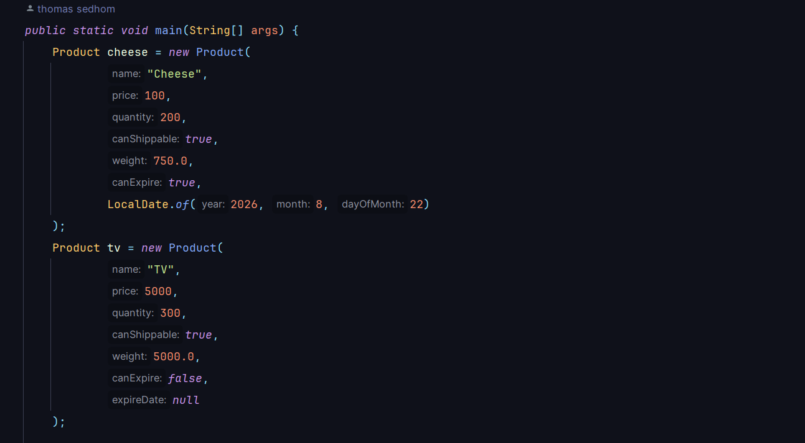
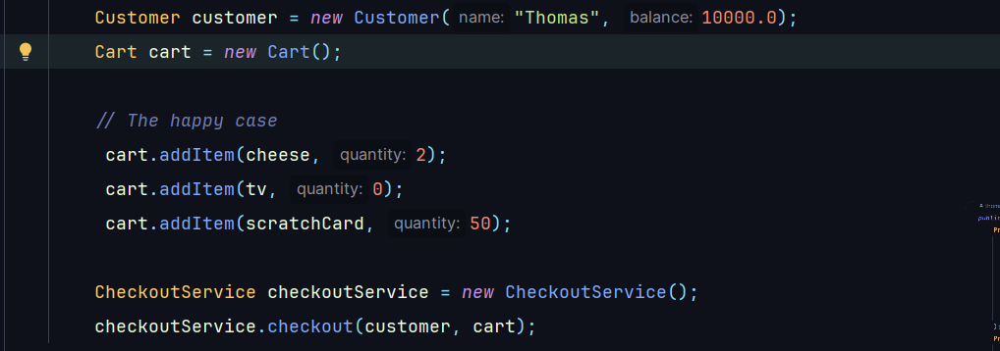
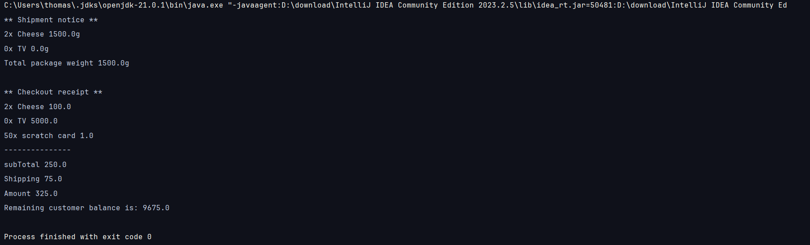

## E-commerce system
A simple Java-based console application that simulate an E-commerce system.
The system uses OOP principles like Abstraction, Polymorphism, Encapsulation, Inheritance

Admin can add new produce, Customer can add products with a quantity number in it's cart and can make a checkout

---
## System structure
    -- Cart
        -- Cart class 
        -- Cart item class
    -- Checkout
        -- Checkout service class
    -- Customer
        -- Customer class
    -- Product 
        -- Product class
        -- Shipping product interface
    -- Shipping
        -- Shipping service 
---
## Input and output screenshots

